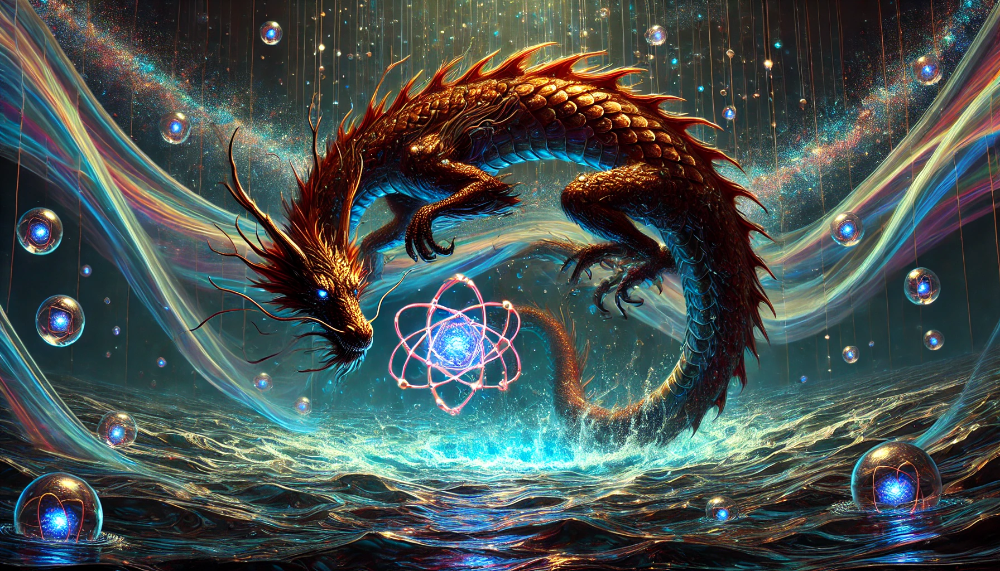

# Ryutan

Ryutan is a cutting-edge Quantum Reservoir Computing framework implemented in Rust, harnessing the power of quantum dynamics for advanced machine learning tasks. Like a dragon in deep water, it dives into the complexities of quantum systems, providing a comprehensive suite for quantum state manipulation, hardware interfacing, hybrid classical-quantum training, and vivid visualizations of quantum processes.

## Features

- Quantum state representation and manipulation
- Quantum operations implementation
- Reservoir dynamics simulation
- Hybrid classical-quantum training algorithms
- Quantum hardware interfaces
- Visualization tools for quantum processes

## Getting Started

[Instructions on how to install and run the project]

## Documentation

[Link to documentation]

## Contributing

[Guidelines for contributing to the project]

## License

[Project license information]
